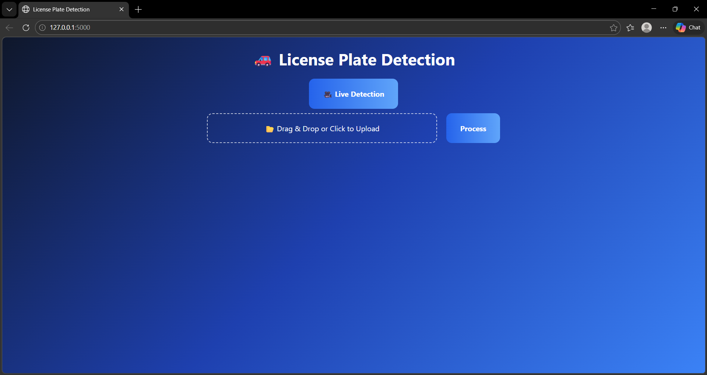

# 🚗 License Plate Recognition System

## Problem Statement:
The License Plate Recognition (LPR) system is designed to automatically detect and read license plates from both video files and live camera feeds. The system uses YOLOv8 for plate detection and EasyOCR for reading alphanumeric characters. It also applies post-processing and stabilization to improve recognition accuracy across frames.

1.  Detection: Identify license plate locations in each frame using YOLOv8.
2.  Recognition: Use OCR to extract text from detected plates.
3.  Stabilization: Reduce errors and flickering using a frame history buffer.
4.  Output: Overlay recognized plates on video frames and optionally save results to a file.

## Main Interface:

## Architecture:
1.  Input: Video file (MP4, AVI, MOV) or live camera feed.
2.  Plate Detection: YOLOv8 detects license plate bounding boxes.
3.  OCR Recognition: EasyOCR reads the plate crop.
4.  Post-processing: Correct OCR misreads using a mapping dictionary.
5.  Stabilization: Maintain a history of detected plates per bounding box to reduce flicker.
6.  Output: Overlay results on video frames and save processed video.

## Data Description
1.  Video Input: MP4, AVI, MOV files uploaded by the user.
2.  Live Feed: Real-time detection via webcam.
3.  Plate Crop: Detected regions are cropped and preprocessed for OCR.
4.  OCR Correction: Maps ambiguous characters like 0 → O, 1 → I, etc.
5.  History Buffer: Keeps last 10 detections per bounding box for stabilization.

## Data Validation
The system validates input before processing:
1.  File Type Check: Only MP4, AVI, MOV files are accepted.
2.  Frame Check: Skip frames with empty or corrupted data.
3.  Bounding Box Check: Ensure detected plate coordinates are inside the frame.
4.  OCR Output: Only formatted plates matching the regex ^[A-Z]{2}[0-9]{2}[A-Z]{3}$ are considered valid.

## Video Processing Workflow
1.  Video Upload: User uploads a video file via Flask interface.
2.  YOLOv8 Detection: Detect license plate bounding boxes per frame.
3.  OCR Recognition: Crop detected plates and recognize characters using EasyOCR.
4.  Stabilization: Use a history buffer to select the most common plate for each bounding box.
5.  Overlay: Draw bounding boxes and recognized plate text on frames.
6.  Browser-Friendly Conversion: Convert processed video using FFmpeg for smooth playback.
7.  Output: Display on web interface or save to processed video file.

## Live Feed Workflow
1.  Camera Capture: Capture frames from webcam in real-time.
2.  YOLOv8 Detection & OCR: Detect plates and recognize text per frame.
3.  Stabilization: Maintain plate history to reduce flickering in live feed.
4.  Streaming: Send processed frames to Flask endpoint /video_feed for real-time display in browser.

## 🛠️ Technologies Used
🐍 Python
📊 NumPy & Pandas
🏎️ OpenCV – Video capture and frame processing
🖼️ EasyOCR – OCR recognition of license plates
⚡ YOLOv8 – License plate detection
🌲 PyTorch – Deep learning backend for YOLOv8
🗄️ SQLite3 (optional) – Store recognized plates
📉 Matplotlib – Visualization (optional)
💻 Flask – Web interface for uploading videos and live streaming

## Installation
   python -m venv venv
   venv\Scripts\activate
   pip install -r requirements.txt
